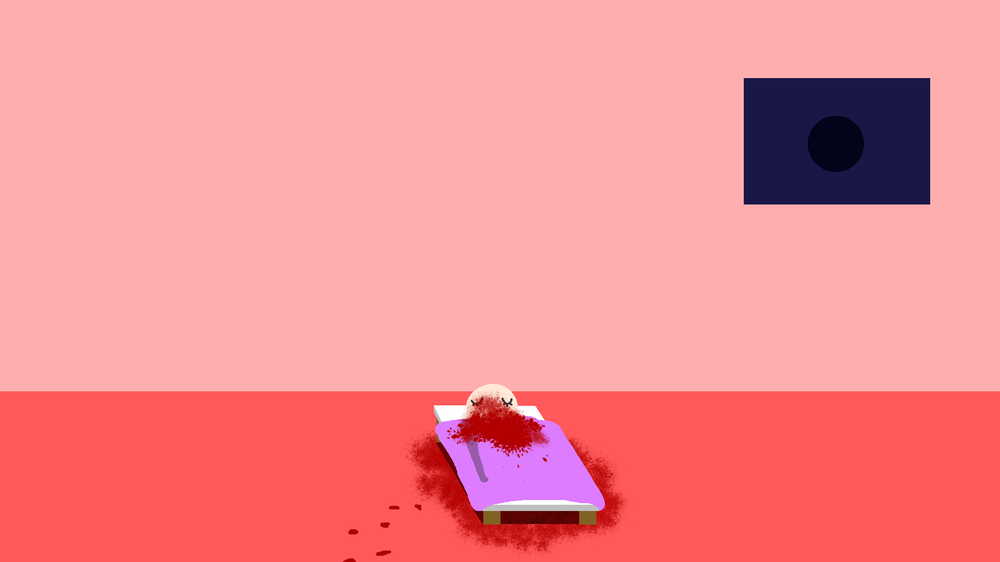

# BrightOrDark
現実の部屋の明かりを消すと、恐ろしいことが起きるというものです。  
## 作品概要
制作人数：1人  
制作時間：4時間  
  
現実世界で部屋の明かりを消すと画面内の部屋も真っ暗になり、再び明かりを点けるとその部屋で惨劇が起こってしまったのが分かるというものです。  
## コンセプト
『**闇の恐ろしさ**』です。  
夜、部屋の明かりを消した時、闇に何かいたら？  
どうなる？どうなった？お前はどうなる?  
現実世界のインタラクションを通して鑑賞者と作中人物は同じ闇に包まれることになります。再び明かりをともすと片や作品内では惨劇が起こってしまいます。闇のベールを目の当たりにし、鑑賞者が次に部屋の明かりを消すとき少し不安になってくれたらいいなと思い作りました。  
## 関連作品
### Ana Somnia(https://anasomnia.com/anasomnia.html)
部屋の明かりを消すと少女が夢を見る作品。  
Flashのサポート終了により今はもう見れなくなってしまったのが残念。  
### ベッドの下の男
有名な怪談。ベッドの下に通り魔が潜んでおり、もしも気付かず寝ると…という話。  
## 作品解説
この作品はベッドの下の男を下地にしたストーリーを展開しました。ベッドの下に潜んだ殺人鬼が闇に乗じて惨劇を引き起こします。  
ここで一つポイントになるのが事件後の血痕がこちら側に伸びている点です。  
  
このことは彼があなたの部屋にやってきたことを表しています。つまり、次明かりを消したら狙われるのはあなただ、ということです。また、部屋の明かりを消させることであなたが惨劇のきっかけを作ってしまったという罪を植えることができます。これにより、仮に血痕に気付かなくても次明かりを消す際に厭な気持ちにする事ができるでしょう。  
このように明かりのON・OFFを現実で行う事で当事者意識を植え付け闇を怖がってもらうというのがこの作品の趣旨になっています。  
## 技術解説
非常に簡単な実装をしています。ProcessingのVideoライブラリでカメラからの映像を入手、2値化して黒と白、どちらが多いかをカウントします。8割以上黒だった場合、部屋が暗いと判断して画面が暗転。次に部屋の明かりがともったら事件後の部屋が映し出されて終了です。  
細かい工夫だと最初の……生前の場面では寝てる人もベッドの下の殺人鬼も僅かに上下運動をしており、呼吸をしているのが伝わります。死後は動きが無くなり、死を感じさせることでしょう。